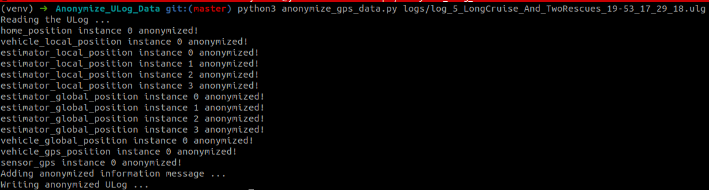
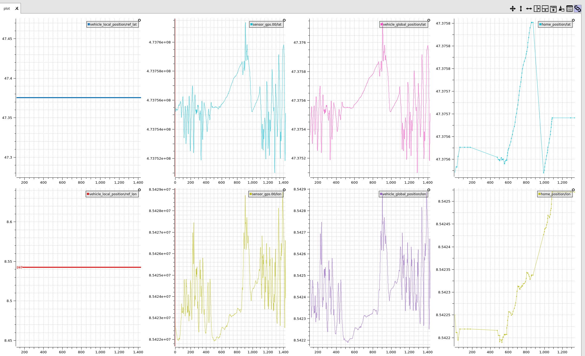
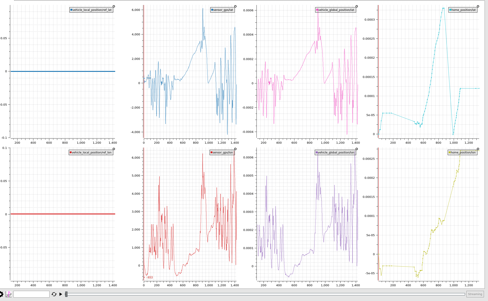

# Anonymize ULog Data

Ever wanted to remove sensitive information from your ULog such as GPS data or anonymize it? This is a solution for you!

This repository contains a script that can modify your GPS location data inside ULog to an arbitrary point.

## Showcase
Here we have the raw data plotted using a [Plotjuggler](https://github.com/facontidavide/PlotJuggler):


After applying anonymization, data plotted turns into this:


So the relative latitude / longitude differences during operation are still visible, but the absolute location is shifted so that the original location is not traceable.

## What the script does
### GPS coordinate anonymization
Script modifies the following uORB topics to anonymize the GPS Latitude / Longitude data:

* home_position
* vehicle_local_position
* estimator_local_position
* estimator_global_position
* vehicle_global_position
* vehicle_gps_position
* sensor_gps

> **Note**, altitude data is not modified!

### Anonymized information
It also adds a new [Information message](https://docs.px4.io/main/en/dev_log/ulog_file_format.html#i-information-message) key-value pair into the uLog:

`"postprocessing.anonymized" : "1"`

## How to use the script
### Clone the repository
> **Note**, this repository relies on the submodule [`pyulog`](https://github.com/PX4/pyulog). So you must clone the repository with `--recursive` option to clone the submodules as well!

```bash
git clone https://github.com/junwoo091400/Anonymize_ULog_Data.git --recursive
```

### Activate python virtual environment
```bash
python3 -m venv venv
source venv/bin/activate
```

### Install the pyulog in the venv
To use the pyulog properly (and install all of it's dependencies), the best option is to install the pyulog in the virtual environment. For which you can do the following:

```bash
cd pyulog/
python setup.py build install
cd ..
```

### Execute the script
Example command (with the example ulog file supplied):

```bash
python3 anonymize_gps_data.py --output_dir ./logs logs/log_5_LongCruise_And_TwoRescues_19-53_17_29_18.ulg
```

Here's the usage:
```bash
anonymize_gps_data.py [-h] [-o OUTPUT_DIR] [-v VERBOSE] ulog_path
anonymize_gps_data.py: error: the following arguments are required: ulog_path
```

## Additional Context
### Magnetometer data
The magnetometer data (e.g. `vehicle_magnetometer`) can give an information about an approximate location of the vehicle using the declination information.

However, this information is not modified in the script yet.

### Plotjuggler Layout
The layout useful for viewing the lat / lon values in Plotjuggler is attached in the repository [here](assets/plotjuggler_LatLon_layout.xml).

You can apply this layout by clicking "File" > "Load layout" in Plotjuggler.